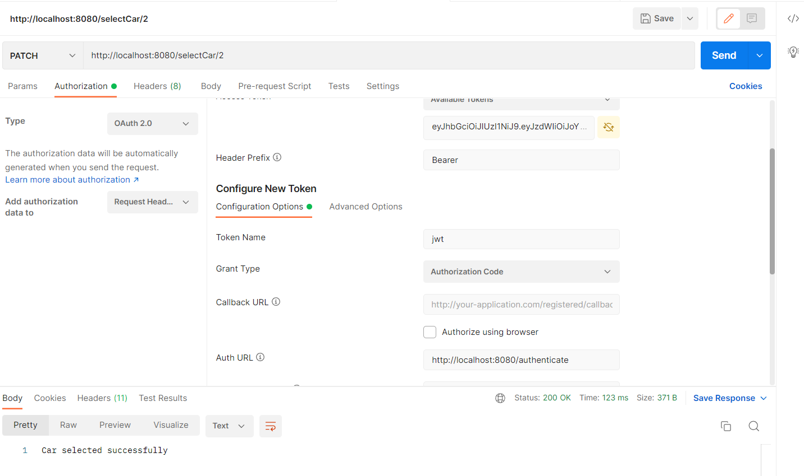

# CarAssignment
##This repository holds an assignment from switch business solutions company
# [Requirements](./req.md)

## to use my API
1. run the Apachi in your device 
2. create a database named ``car``
3. setup your ``application.properties`` file to connict the app wit database
4. Use an API platform like postman to play my backend

## First you should creat a driver by passing the driverName & password as param to rout ``/createDriver``

## Create how much cars you want by passing the params to rout ``/createCar``
````
licensePlate;
seats;
convertible;
rating;
engineType;
manufacturer;
````


## you should login  as a driver to select a car
### login by passing a user name  and password as a json body in post method  in rout `/authenticate`

>> you must copy the tokin to use it to select a car


## Now to select a car create a `PATCH` method with /selectCar rout and pass the carID as param
## Open the Authorization tap and fill the tokin that you toke from the login response 
## fill Token Name = jwt && Auth URL = http://localhost:8080/authenticate
## then send the request 



## Also you can use other routs 
* /getCar/{id}
* /getCars
* /deleteCar/{id}
* /updateCar/{id}
* /getDriver/{id}
* /getDrivers
* /deleteDriver/{id}
* /deSelectCar


